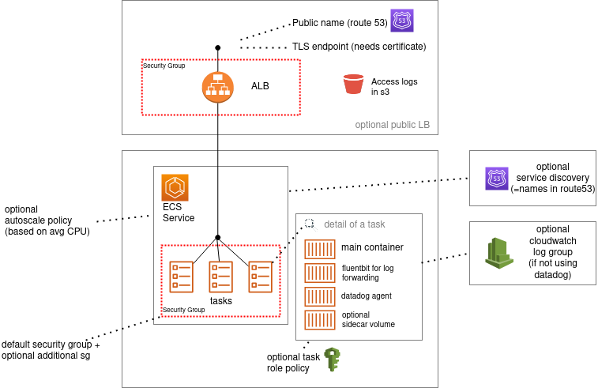

# Terraform modules

## ECS Fargate Service

Deploys a Fargate service on an ECS cluster, with optional public load-balancer, TLS-termination, private discovery.




Required (= input variables):
- a VPC with private and public subnets. Look at [terraform-aws-modules/vpc/aws](https://github.com/terraform-aws-modules/terraform-aws-vpc) to create one easily.
- an ECS cluster ready for use
- Route53 zone and AWS-managed TLS certificate, if public load-balancer is desired


Capabilities:
- create a Fargate service
- create associated task from a docker image address (1 task per service)
- task may have an optional side-car with volumes to mount into the task container
- logs can be sent to Cloudwatch logs or Datadog (via AWS firelens & fluent-bit)
- tasks can have an optional datadog agent running
- service can have an optional public ALB
- this ALB is given a name in Route53, with TLS termination, and associated https certificate.
- service can optionally be referenced in service registry for local discovery (that is, in a Route53 DNS private .local zone)
- service can optionaly be created inside a given security group (for example to be designated as allowed ingress in a DB security group)
- autoscale can be activated in target tracking mode, on CPU average utilization
- an IAM policy can be given to the task (for example, to have role-based access to s3)


Outputs:
- ALB details: URL, DNS name and zone


Future improvements:
- better handling of secrets using https://aws.amazon.com/premiumsupport/knowledge-center/ecs-data-security-container-task/ 
- more outputs


# About tests

- tests are not using a remote backend for state (only local state). You still need to specify a workspace to reference a remote state for pre-existing resources (eg. ECS cluster)

- typical worfklow is to run a single test using resource targeting:
```
TF_WORKSPACE=test terraform apply -target=module.test_names
...
TF_WORKSPACE=test terraform destroy -target=module.test_names
```

- always destroy what you do at the end of the tests


